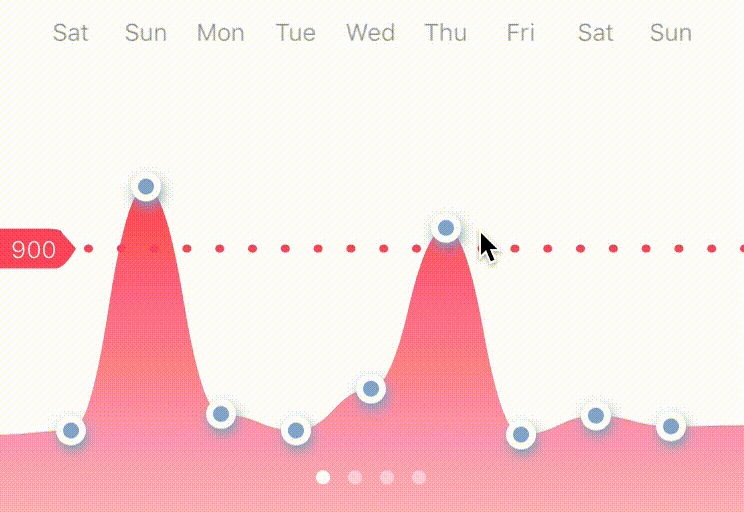

# HamsterUIKit
A simple and elegant UIKit for iOS.

## Installation
### CocoaPods
Add to your Podfile:
```
use_frameworks!
pod 'HamsterUIKit'
```
Type in terminal:
```
pod install
 ```

Import the framework
```
import HamsterUIKit
```


## Curve Chart
All protocols are designed based on UIKit. If you are familiar with UITableView or UICollectionView, you can draw an elegant graph in 10 minutes.


### Quick start

Inherit protocol to ViewController:
```
MyController:UIViewController, HamsCurveChartDelegate, HamsCurveChartDataSource
```

Create a view by stroyboard or code:
```
var hamsCurveChart = HamsCurveChart(frame: CGRect(origin: CGPoint(x:0, y: 50), size: CGSize(width: 375, height: 200)))
```

Bind delegate and datasource to self controller in ```func viewDidLoad()```:

```
hamsCurveChart.delegate = self
hamsCurveChart.dataSource = self
hamsCurveChart.offsets = ChartOffset(top: 65, bottom: 60, column: 0, horizon: 0) // set offset
self.view.addSubview(hamsCurveChart) // add hamsCurveChart to self.view
```

Implement protocol ```HamsCurveChartDataSource``` to load datasets and decorate each point in the same view.
For single view
```
func curveChart(_ curveChart: HamsCurveChart, numberOfPointsInView view: Int) -> Int {
		return dataSets.count
}
func numberOfViews(in tableView: HamsCurveChart) -> Int {
	return 1
}
func curveChart(_ curveChart: HamsCurveChart, pointForChart indexPath: HamsIndexPath) -> HamsCurveChartPoint {
		let point = HamsCurveChartPoint()
		switch indexPath.view {
		case 0:
			point.innerColor = UIColor.blue
			point.pointValue = CGFloat(dataSets[indexPath.point])

		default:break
  }
	return point
}
```

Implement protocol ```HamsCurveChartDelegate``` to custom chart's background, suggestion, maxValue or endpoint.
You must implement:
```
func curveChart(_ curveChart: HamsCurveChart, configureForViews view: Int) {
		switch view {
		case 0:
			hamsCurveChart.filledColor = .gradient(top: redDark, bottom: red)
			hamsCurveChart.startPoint = .zero
			hamsCurveChart.suggestValue = 900
		default:break
	}
}
```

Reload data exactly same as UITableView, you may reload data when Scene is showing in ```func viewWillAppear(_ animated: Bool)```:
```
override func viewWillAppear(_ animated: Bool) {
  dataSets = [1,2,4,5,1,3,400]]
  hamsCurveChart.reloadData()
}
```
or observing Notification to reduce unnecessary redraw.


## Todo
Advanced Configuration

## Created By:
Howard Wang - [Hire me](https://www.linkedin.com/in/jiongzhi-wang-a32483132/)

[Zhiye Jin](http://www.zhiye-jin.com)(UI Designer)

Healthy Fridge Project - [Hamster Fridge Management](https://itunes.apple.com/us/app/hamster-fridge-management/id1227220933?mt=8)

## License
HamsterUIKit is Copyright (c) 2017 Howard Wang and released as open source under the attached [Apache 2.0 license](https://github.com/ChromieIsDangerous/HamsterUIKit/blob/master/LICENSE).

THE SOFTWARE IS PROVIDED "AS IS", WITHOUT WARRANTY OF ANY KIND, EXPRESS OR IMPLIED, INCLUDING BUT NOT LIMITED TO THE WARRANTIES OF MERCHANTABILITY, FITNESS FOR A PARTICULAR PURPOSE AND NONINFRINGEMENT. IN NO EVENT SHALL THE AUTHORS BE LIABLE FOR ANY CLAIM, DAMAGES OR OTHER LIABILITY, WHETHER IN AN ACTION OF CONTRACT, TORT OR OTHERWISE, ARISING FROM, OUT OF OR IN CONNECTION WITH THE SOFTWARE OR THE USE OR OTHER DEALINGS IN THE SOFTWARE.
